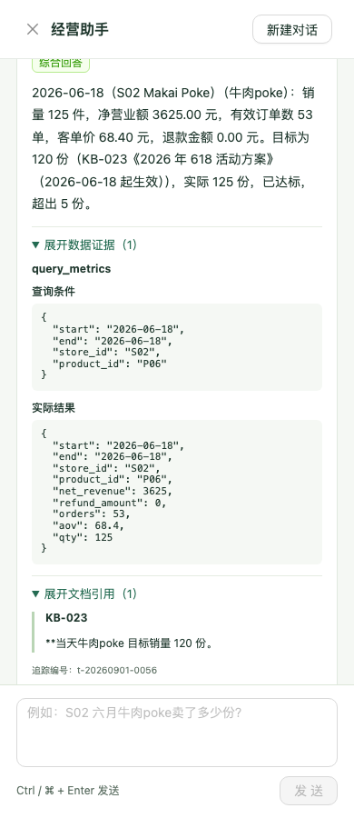

# 经营助手演示：实绩与活动目标

本例来自 **4591fab** 固定版本的一次原公开题库真实模型运行，题目 H02。它是一条通过的样本；整套真实评测为 **67.5/100、40/55**，失败与边界见 [G3-05 原始记录](docs/verification/g3-05/README.md)和 [评测报告](EVAL_REPORT.md)。

## 在看板中操作

1. 按 [README](README.md) 从源码安装、重建并启动；使用获授权的真实模型配置时 health 应为 `live`。无 Key 也能操作该问题，但下方具体真实模型响应属于历史固定运行。
2. 点击右下角“经营助手”，输入：**618 当天 S02 的牛肉poke 卖了多少份？达到目标了吗？**
3. 展开“数据证据”和“文档引用”，分别核对数据库查询条件、结果，以及活动方案连续原文。新建对话后可用同一界面继续提问；看板筛选不会暗中改变聊天条件。

本次真实回答把 **125 份**与目标 **120 份**放在同一条回答中，计算超出 **5 份**、已达标。数据证据记录 `query_metrics(start=2026-06-18,end=2026-06-18,store_id=S02,product_id=P06)`，结果 `qty=125`；计算关系记录 `125-120=5`。文档证据来自 **KB-023**《2026 年 618 活动方案》，连续原文为“**当天牛肉poke 目标销量 120 份。”；引用包含片段位置、适用日期与 S02 门店范围。

可逐项检查 [真实请求、响应与 trace](docs/verification/g3-05/eval-live/chat-trace.jsonl)、[官方逐题报告](docs/verification/g3-05/eval-live/report.json)。该 turn 的 trace_id 为 `t-20260901-0020`，仅在那次进程中可通过 `/api/trace/{trace_id}` 读取；进程重启后不能把旧 trace_id 当成持久接口。当前启动服务会生成新的 trace_id。

下面是**无 Key mock 路径**的 390 宽度浏览器截图，展示同一问题如何展开两类证据；它只证明界面可见性，不冒充上面的真实模型浏览器交互：

## 输入替换后的对照

在独立临时副本中，原始 SQL 手算得到 2026-06-18 S02/P06 **7 份**。目标文档先改为 **10 份**，回答为未达标、差 3 份；再改为 **6 份**并重建重启，回答为已达标、超出 1 份。两阶段的工具结果、引用和 trace 保存在 [替换运行记录](docs/verification/g3-05/replacement/results.json)。这证明目标计算与输入一起变化；它是无 Key 模式的受控替换证据，不能证明真实模型对任意新文档都能准确选择。

## 最终固定点的真实浏览器定向边界

最终修复集成提交 `c7084d6` 上，在真实 Chromium 新会话问“外卖订单退款审核通过后，退款多久能到账？”。实际返回 HTTP 200 `refusal`，但 trace 显示模型两次请求 `search_kb(top_k=15)`，超过工具允许的 1–10；之后改为 `top_k=10` 检索到 KB-013 退回渠道，最终仍因先前工具失败返回技术拒答。完整 [浏览器请求、回答、trace](docs/verification/g3-05/final-c7084d6/target/policy-browser.json)和 [截图](docs/verification/g3-05/final-c7084d6/target/policy-browser.png)留存。它没有把“送达后 24 小时内提出”误说成到账期限，但**不能算已经证明模型理解“申请窗口”和“到账时间”的区别**。

另一个批准的自然样本要求主动引用 S03 6 月 8–14 日趋势并问“这段时间的净营业额为什么比前一周低？”。同一提交的免费受控 HTTP 重放证实，模型若调用前周对照 `compare_periods`，范围守卫返回“比较查询与文字明确指定的有效条件不一致”；原请求和 trace 在 [受控记录](docs/verification/g3-05/final-c7084d6/fresh/controlled-prevweek.json)。这条**未发送真实模型请求**，不能把受控失败或 mock 错答称作真实模型成绩。该限制需要在现场调试时明确告知。
