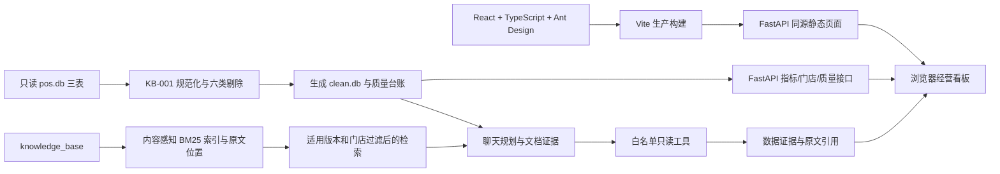

# Moneki 经营看板与问答助手

已实现日期/门店筛选、五项经营指标、每日净营业额趋势、Top 10 商品和全量数据质量台账。
页面使用真实清洗数据，Python/FastAPI 同源提供 API 与 React 生产页面，无 Key 可用。
当前源码还包含聊天侧栏、只读数据与知识库工具、混合问答、有限内存会话和用户主动添加的每日趋势引用。无 Key 使用保守降级回答，证据不足时允许拒答；最终修复集成固定点 `c7084d6` 的一次完整真实 DeepSeek 评测为 **94/100、52/55**，仍有 C07、V03、H06 三道未全通过，详见 [G3-05 最终记录](docs/verification/g3-05/final-c7084d6/README.md)。
[原始任务书全文](docs/ASSIGNMENT.md)保持可查，[必须遵守的 API 契约](docs/API_CONTRACT.md)未改。

## 三步从源码启动

前提：macOS 或 Linux、Python **3.12**（命令 `python3.12`，含 venv/pip）、Node.js **22.12+**
（本次实际验证 24.19.0）和 npm、GNU Make，以及首次安装时可访问 Python/npm 包源的网络。
不需要 uv、数据库服务器、模型 Key 或模型文件。以下从仓库根目录执行：

```bash
make setup       # 1. 创建 starter/.venv，安装 Python 依赖和 npm 锁定依赖
make rebuild     # 2. 清洗 POS、生成索引缓存、类型检查并从源码构建前端
make run         # 3. 前台启动，浏览器访问 http://127.0.0.1:8000/
```

按 Ctrl+C 停止。端口占用时用 `make run PORT=8015`，访问相应端口。
`PYTHON=/path/to/python3.12 make setup` 可指定 Python。无须激活虚拟环境。
默认 `make run` 强制清除 `LLM_API_KEY` / `LLM_BASE_URL` / `LLM_MODEL`，不加载 `.env` 或 `.env.live`；
`/api/health` 应显示 `llm_mode: "mock"`。页面读取指标、质量、门店与聊天接口；聊天的经营数字来自只读数据库工具，文档引用来自当前知识库索引。
依赖下载缓存可加速安装，但不是运行前提。Python 依赖的本次实装版本保存在验收证据中，尚未锁定未来包源版本。

## 更换数据、重建与重启

生产输入是 `data/pos.db` 的 `sales`、`stores`、`products` 三表；CSV 是随包提供的同内容参考，
**仅替换 CSV 不会改变结果**。请按[任务书的字段结构](docs/ASSIGNMENT.md)替换 SQLite 输入，
知识库仍放在 `knowledge_base/`。停止服务后执行 `make rebuild`，再 `make run`，刷新页面。
源库以 SQLite 只读模式打开，输出为 `starter/var/clean.db`；不会回写原始输入。

也可保留仓库样本，指向外部同结构目录。三个目录参数应使用绝对路径，在重建和运行时保持一致：

```bash
make rebuild DATA_DIR=/absolute/new-data KB_DIR=/absolute/new-kb VAR_DIR=/absolute/new-output
make run DATA_DIR=/absolute/new-data KB_DIR=/absolute/new-kb VAR_DIR=/absolute/new-output PORT=8015
```

重建包含前端构建；清洗库成功完成后原子替换。无销售行时日期范围为空，页面显示明确空态，门店仍来自维表。
已有服务持有当前数据/索引对象，不承诺热更新；**重建后必须重启**。
索引缓存位于 `starter/.cache/index.json`，按知识库路径、文件内容和处理版本失效；health 报告实际入库文档和片段数。
知识库支持带 `KB-xxx` 文件编号的 Markdown、TXT（UTF-8/GBK）和静态 HTML 可见正文，说明文件不计入索引。
第二关已通过新增、修改、删除、切换目录、事实/别名及格式编码变化的重建和重启验证；原文连续引用由同次输入快照核对。

## 架构与取舍



- 保留 Python/FastAPI + SQLite：沿用契约与 starter，计算路径可追溯，当前规模无需新增数据库或消息队列。
- React/TypeScript + Ant Design 提供筛选与状态组件；Vite 构建后同源交付，评审只需运行一个服务。开发时用 Vite `/api` 代理。
- `Dashboard` 持有已生效日期/门店，输入草稿点击查询后同时作用于汇总、趋势、排行。请求取消、超时与版本隔离避免旧响应覆盖新条件。
- 质量台账描述整次重建，始终不随看板筛选变化。默认日期来自实际清洗范围，门店与商品名称来自输入维表。
- 桌面优先，验收 1280/1440；390 窄屏可筛选、纵向阅读，趋势及表格在自身容器内滚动。聊天在右侧栏，有限内存会话与看板条件分离；只有用户点击“加入提问”才附带当时的每日趋势范围。

口径以 [KB-001 v3](knowledge_base/handbook/KB-001_指标口径手册_v3.md) 为准：先规范化，再按六项顺序仅计首次剔除原因；合法多商品订单保留，退款按自身日期归属。
金额直接用实收 `amount`，不按建档单价反推；净额包含退款，订单数只对正金额行订单号去重，销量扣除退款数量，客单价 Decimal 四舍五入两位。
API 日期是闭区间，每日结果补零；无订单客单价为 null。零金额既不是销售也不是退款，但不在六条剔除规则内。
非空且非数字金额若未被前序规则剔除，会令重建报错并保留旧清洗库，不擅自新增口径。
Top 10 按净营业额降序，同额按商品编号稳定排序；不把样本金额、日期或名称写入生产逻辑。

## 验证与证据

[第一关正式验收记录](docs/verification/g1-05/README.md)记录被测提交、干净副本、完整命令、环境、原始/替换/空数据检查及截图。
[第二关整体验收记录](docs/verification/g2-05/final/README.md)保存新安装环境、199项真实RAG、知识库替换和第一关浏览器回归。
[评测报告](EVAL_REPORT.md)并列原始无模型17/100、原始真实模型25.5/100、第二关起点41/100与整体验收88.5/100，第三关首个集成提交 `4591fab` 的无 Key **94/100、53/55**、真实模型 **67.5/100、40/55**，以及最终集成 `c7084d6` 的真实模型 **94/100、52/55**。最终提交未重跑完整无 Key 55 题，各阶段代码和模式不能混作同一版本收益。
[调试记录](DEBUG_LOG.md)与 [AI 使用说明](AI_USAGE.md)区分真实缺陷、验收脚本问题与尚未验证事项。
现场遇到错答时，按 [调试证据流程](docs/DEBUG_WORKFLOW.md)保存这次响应的 trace、独立预期和固定提交，再让 Codex 先定位分叉；不需要新增调试面板，也不要粘贴 Key。

本地后端回归与公开指标评测（先启动原始数据服务）：

```bash
env -u LLM_API_KEY -u LLM_BASE_URL -u LLM_MODEL starter/.venv/bin/python -m pytest starter/tests -q
python3.12 eval/run_eval.py --base-url http://127.0.0.1:8000 --questions eval/public_questions.jsonl --only metrics --out /tmp/moneki-metrics-new
```

浏览器回归安装 Chromium 后运行；旧测试默认向前序证据目录截图，须使用[验收脚本](docs/verification/g1-05/run_browser.sh)统一重定向。
开发入口与各阶段说明见 [starter 运行说明](starter/README.md)和[前端说明](frontend/README.md)。

## 单轮文档 API 与已知边界

启动后可通过同一服务调用；页面同时提供经营看板和“经营助手”聊天侧栏：

```bash
curl -s http://127.0.0.1:8000/api/retrieve -H 'Content-Type: application/json' \
  -d '{"query":"外卖订单多久内可以退款","top_k":5}'
curl -s http://127.0.0.1:8000/api/chat -H 'Content-Type: application/json' \
  -d '{"session_id":"single-demo","question":"2026-06-14当时外卖订单多久内可以申请退款？"}'
```

沿用 BM25，不下载嵌入模型或部署检索服务。中文相邻二元词项、英文整词与知识库别名支持检索；
适用版本/门店先过滤，补位片段不作为问答证据。分块保存原文偏移与同源标题/表头上下文，
长普通行使用重叠以保留边界事实。引用回到真实连续正文，展示标题不会吞掉同名正文。
这些是本地无模型模式的实现选择，不等于通用语言理解；低分或证据不足时保守拒答。

上述段落是第二关单轮无 Key 实现背景；当时公开剩余未全绿为 V03、H01、H06、T01、T02、T03。第三关已加入混合、多轮和趋势功能，但首个真实集成全量暴露其他失败，见下文。根三步入口始终清除模型配置，不能从无 Key 得分推导真实模型成绩。

### 经营助手（G3-01）

点击看板右下角“经营助手”，输入含日期、门店/商品与指标的完整问题；可展开真实查询条件和结果。聊天不自动继承看板筛选。新建对话使用新 session，等待中不可重复提交，旧请求不会写入新对话。

需要真实模型时，安全地设置 `LLM_BASE_URL` / `LLM_API_KEY` / `LLM_MODEL` 后运行 `make run-live`；详见 [LLM_SETUP.md](LLM_SETUP.md)。根默认入口继续使用无 Key 模式。`4591fab` 的真实评测使用默认思考模式及 4096 输出上限；它导致若干 `finish_reason=length`，后续修复会另以新固定提交和配置复验。回答中的经营数字由工具结果及代码计算和渲染。

## 第三关验收状态与演示

原官方 55 题在固定业务提交 `4591fab` 的 fresh 源码上完整运行，无 Key **94/100、53/55**，真实 DeepSeek `deepseek-flash` **67.5/100、40/55**。原始逐题逐轮失败、模型请求、trace 和保守费用估算在 [G3-05 原始检查点](docs/verification/g3-05/README.md)；单题混合路径可按 [DEMO](DEMO.md) 查看数据证据、目标原文和计算关系。两次是同一业务代码、不同运行模式的观察，不等于隐藏题或生产能力。

独立替换实测 618 目标 10→6 后，7 份实际销量由未达标变已达标；当前退款 30 小时与历史 7 天引用也随输入和时效变化。新增事件可检索但该 mock 问答拒答，不能算事件语义通过。替换测试还发现显式“6 月 18 日”查询被扩到 7 月 1 日并把相邻日期 5 份计入，缺陷已交原实现会话；后续应同时核查 `data_evidence.params` 和结果。真实文档、版本、多轮失败也在原任务修复中，**本检查点并非第三关最终验收**。

最终集成 `c7084d6` 从独立源码导出并重建、构建；复用此前已经真实安装且验证的 Python/npm 依赖，未称本轮重新安装。一次未改官方 55 题完整真实模型复验 **94/100、52/55**，分类、三题失败及 102 次 API/费用见 [最终验收](docs/verification/g3-05/final-c7084d6/README.md)。此前 `4591fab` 的 67.5/40 和无 Key 94/53 是历史检查点；**没有**在最终提交重跑无 Key 全题，不能将旧 94/53 标为 `c7084d6`。真实趋势前周比较存在范围守卫限制；真实退款到账负例因工具参数错误技术拒答，不能算语义安全通过。第四关按用户选择整理现有证据，现场调试步骤和可复制提示词见 [调试证据流程](docs/DEBUG_WORKFLOW.md)，没有新增调试面板。
