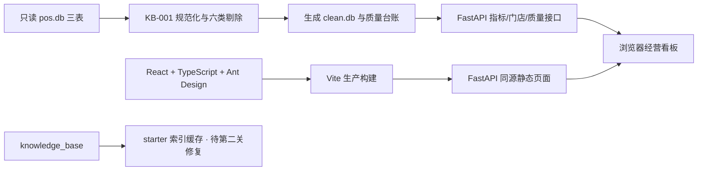

# Moneki 经营看板 · 第一关交付

已实现日期/门店筛选、五项经营指标、每日净营业额趋势、Top 10 商品和全量数据质量台账。
页面使用真实清洗数据，Python/FastAPI 同源提供 API 与 React 生产页面，无 Key 可用。
当前交付范围是**第一关**；starter 的 RAG/问答仍有已知缺陷，尚未交付第二至四关的 AI 体验。
[原始任务书全文](docs/ASSIGNMENT.md)保持可查，[必须遵守的 API 契约](docs/API_CONTRACT.md)未改。

## 三步从源码启动

前提：macOS 或 Linux、Python **3.12**（命令 `python3.12`，含 venv/pip）、Node.js **22.12+**
（本次实际验证 24.19.0）和 npm、GNU Make，以及首次安装时可访问 Python/npm 包源的网络。
不需要 uv、数据库服务器、模型 Key 或模型文件。以下从仓库根目录执行：

```bash
make setup       # 1. 创建 starter/.venv，安装 Python 依赖和 npm 锁定依赖
make rebuild     # 2. 清洗 POS、生成索引缓存、类型检查并从源码构建前端
make run         # 3. 前台启动，浏览器访问 http://127.0.0.1:8000/
```

按 Ctrl+C 停止。端口占用时用 `make run PORT=8015`，访问相应端口。
`PYTHON=/path/to/python3.12 make setup` 可指定 Python。无须激活虚拟环境。
根入口强制清除 `LLM_API_KEY` / `LLM_BASE_URL` / `LLM_MODEL`，不加载 `.env` 或 `.env.live`；
`/api/health` 应显示 `llm_mode: "mock"`。页面只调用只读指标/质量/门店接口。
依赖下载缓存可加速安装，但不是运行前提。Python 依赖的本次实装版本保存在验收证据中，尚未锁定未来包源版本。

## 更换数据、重建与重启

生产输入是 `data/pos.db` 的 `sales`、`stores`、`products` 三表；CSV 是随包提供的同内容参考，
**仅替换 CSV 不会改变结果**。请按[任务书的字段结构](docs/ASSIGNMENT.md)替换 SQLite 输入，
知识库仍放在 `knowledge_base/`。停止服务后执行 `make rebuild`，再 `make run`，刷新页面。
源库以 SQLite 只读模式打开，输出为 `starter/var/clean.db`；不会回写原始输入。

也可保留仓库样本，指向外部同结构目录。三个目录参数应使用绝对路径，在重建和运行时保持一致：

```bash
make rebuild DATA_DIR=/absolute/new-data KB_DIR=/absolute/new-kb VAR_DIR=/absolute/new-output
make run DATA_DIR=/absolute/new-data KB_DIR=/absolute/new-kb VAR_DIR=/absolute/new-output PORT=8015
```

重建包含前端构建；清洗库成功完成后原子替换。无销售行时日期范围为空，页面显示明确空态，门店仍来自维表。
已有服务持有当前数据/索引对象，不承诺热更新；**重建后必须重启**。
索引仍使用 starter 的 `starter/.cache/index.json` 缓存，知识库变更感知与文档计数已知问题留待第二关；
第一关验证只覆盖销售/门店/商品替换，不能据此宣称知识库替换验收通过。

## 架构与取舍



- 保留 Python/FastAPI + SQLite：沿用契约与 starter，计算路径可追溯，当前规模无需新增数据库或消息队列。
- React/TypeScript + Ant Design 提供筛选与状态组件；Vite 构建后同源交付，评审只需运行一个服务。开发时用 Vite `/api` 代理。
- `Dashboard` 持有已生效日期/门店，输入草稿点击查询后同时作用于汇总、趋势、排行。请求取消、超时与版本隔离避免旧响应覆盖新条件。
- 质量台账描述整次重建，始终不随看板筛选变化。默认日期来自实际清洗范围，门店与商品名称来自输入维表。
- 桌面优先，验收 1280/1440；390 窄屏可筛选、纵向阅读，趋势及表格在自身容器内滚动。聊天留待第三关的侧栏，未来会话状态与看板条件分别管理；当前无不可用聊天入口。

口径以 [KB-001 v3](knowledge_base/handbook/KB-001_指标口径手册_v3.md) 为准：先规范化，再按六项顺序仅计首次剔除原因；合法多商品订单保留，退款按自身日期归属。
金额直接用实收 `amount`，不按建档单价反推；净额包含退款，订单数只对正金额行订单号去重，销量扣除退款数量，客单价 Decimal 四舍五入两位。
API 日期是闭区间，每日结果补零；无订单客单价为 null。零金额既不是销售也不是退款，但不在六条剔除规则内。
非空且非数字金额若未被前序规则剔除，会令重建报错并保留旧清洗库，不擅自新增口径。
Top 10 按净营业额降序，同额按商品编号稳定排序；不把样本金额、日期或名称写入生产逻辑。

## 验证与证据

[第一关正式验收记录](docs/verification/g1-05/README.md)记录被测提交、干净副本、完整命令、环境、原始/替换/空数据检查及截图。
[评测报告](EVAL_REPORT.md)保留原始无模型 17/100、真实模型 25.5/100 两组基线，新增本关 metrics **6/6** 阶段记录；这不是最终全量 100 分。
[调试记录](DEBUG_LOG.md)与 [AI 使用说明](AI_USAGE.md)区分真实缺陷、验收脚本问题与尚未验证事项。

本地后端回归与公开指标评测（先启动原始数据服务）：

```bash
env -u LLM_API_KEY -u LLM_BASE_URL -u LLM_MODEL starter/.venv/bin/python -m pytest starter/tests -q
python3.12 eval/run_eval.py --base-url http://127.0.0.1:8000 --questions eval/public_questions.jsonl --only metrics --out /tmp/moneki-metrics-new
```

浏览器回归安装 Chromium 后运行；旧测试默认向前序证据目录截图，须使用[验收脚本](docs/verification/g1-05/run_browser.sh)统一重定向。
开发入口与各阶段说明见 [starter 运行说明](starter/README.md)和[前端说明](frontend/README.md)。
